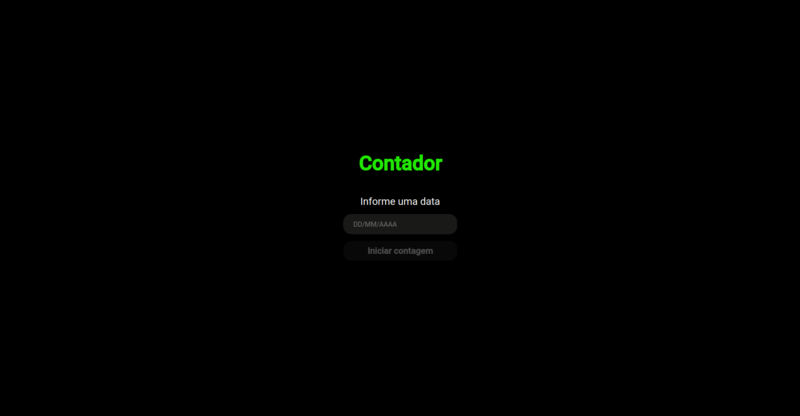
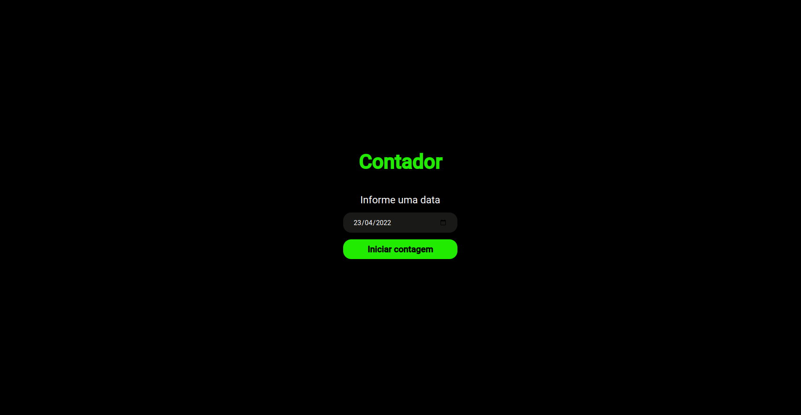
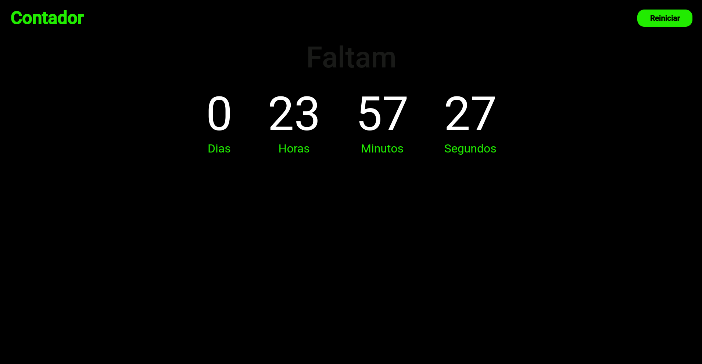
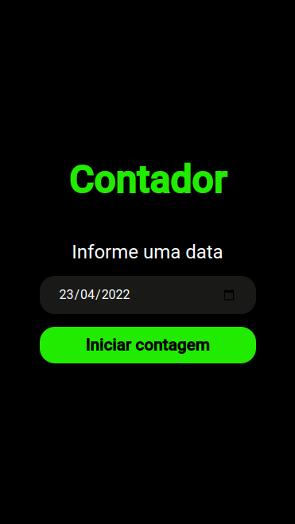
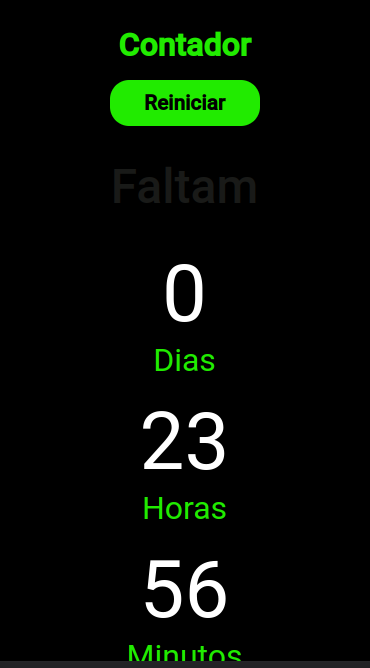

# Countdown Application

I created this app to increase my skills with React and its entire ecosystem. The application has the task of calculate left days from a date inserted by the user.

So when de countdown become 0 the music <strong>"It's final countdown</strong>" begin to play.

If you want to see the application already running in production click on the link [aqui](https://countdown-timer-nine-gilt.vercel.app/)

# Table of contents

- [Countdown Application](#countdown-application)
- [Table of contents](#table-of-contents)
- [Development language](#development-language)
- [Architecture Folder](#architecture-folder)
- [Dependencies](#dependencies)
- [Development dependencies](#development-dependencies)
- [Getting Started](#getting-started)
- [Features i done](#features-i-done)
- [Next features](#next-features)
- [Desktop](#desktop)
- [Mobile](#mobile)

# Development language

The project was developed using the ReactJS library with Typescript.

# Architecture Folder

Below is a drawing of how the structure was developed.

```bash
Countdown
├── public/
│   ├── index.html
│   ├── favico.ico
│   ├── manifest.json
│   ├── robots.txt
├── screenshots/
├── src/
│   ├── assets/
│   │   └── mp3/
│   ├── global/
│   │   └── styles/
│   │       ├── index.ts
│   │       ├── styles.d.ts
│   │       ├── theme.ts
│   ├── pages/
│   │   └── countdown/
│   │       ├── index.tsx
│   │       ├── styles.ts
│   │   └── home/
│   │       ├── index.tsx
│   │       ├── styles.ts
│   ├── routes/
│   │   ├── index.ts
│   ├── shared/
│   │   └── components/
│   │       └── button/
│   │           ├── index.tsx
│   │           ├── styles.ts
│   │       └── form/
│   │           └── input/
│   │               ├── index.tsx
│   │               ├── input.test.tsx
│   │               ├── styles.ts
│   │            ├── index.ts
│   │       └── context/
│   │           └── countdownProvider/
│   │               ├── index.tsx
│   │               ├── countdownProvider.test.tsx
│   │               ├── styles.ts
│   │            ├── index.ts
│   │       └── declarations/
│   │           ├── audio.d.ts
│   │       └── utils/
│   │           └── tests/
│   │               ├── mocktheme.tsx
│   ├── App.test.tsx
│   ├── App.tsx
│   ├── index.tsx
│   ├── react-app-env.d.ts
│   ├── setupTests.ts
├── .editorconfig
├── package.json
├── README.md
├── tsconfig.json
├── yarn.lock
```

# Dependencies

- [React](https://pt-br.reactjs.org/docs/create-a-new-react-app.html)
- [Styled Components](https://github.com/styled-components/styled-components)
- [Typescript](https://www.typescriptlang.org/)
- [Yarn](https://yarnpkg.com/)

# Development dependencies

- [React Test Renderer](https://pt-br.reactjs.org/docs/test-renderer.html)

# Getting Started

After cloning the project, run the command, at the root of the project.

with npm

```console
  npm install
```

with yarn

```console
  yarn install
```

After all dependencias has been installed, run the command

with npm

```console
  npm run start
```

with yarn

```console
  yarn start
```

Open the browser and access http://localhost:3000

# Features i done

- ✔️ Create Home Page.
- ✔️ Create Countdown Page.
- ✔️ Create Countdown Provider.
- ✔️ Create Countdown Timer.

# Next features

- Finish Unit tests.
- Github pipes.

# Desktop







# Mobile






Design created by [Lorenalgm](https://github.com/Lorenalgm/contador) for Dev challenge
